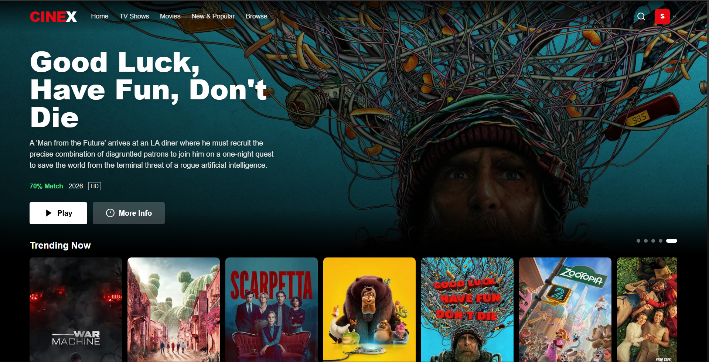

# CineX 🎬

A full-stack Netflix-inspired streaming platform built with Next.js, TypeScript, Node.js, Express, and MongoDB. Powered by the TMDB API for real-time movie and TV content.



---

## 🚀 Tech Stack

| Layer      | Technology                          |
|------------|-------------------------------------|
| Frontend   | Next.js 14, Tailwind CSS, TypeScript |
| Backend    | Node.js, Express.js                 |
| Auth       | JWT with HTTP-only cookies          |
| Database   | MongoDB Atlas                       |
| Content API| TMDB (The Movie Database)           |

---

## 📁 Project Structure
```
cinex-streaming-platform/
├── cinex-frontend/    # Next.js frontend
├── cinex-backend/     # Express.js backend
└── README.md
```

---

## ⚙️ Getting Started

### Prerequisites
- Node.js v18+
- MongoDB Atlas account
- TMDB API key → [Get one here](https://www.themoviedb.org/settings/api)

### 1. Clone the repository
```bash
git clone https://github.com/syed-kaif07/cinex-streaming-platform.git
cd cinex-streaming-platform
```

### 2. Setup Backend
```bash
cd cinex-backend
npm install
cp .env.example .env
```

Fill in your `.env` file:
```dotenv
PORT=5000
MONGODB_URI=your_mongodb_atlas_uri
JWT_SECRET=your_jwt_secret
TMDB_API_KEY=your_tmdb_api_key
CLIENT_URL=http://localhost:3000
```

Then run:
```bash
npm run dev
```

### 3. Setup Frontend
```bash
cd cinex-frontend
npm install
cp .env.example .env.local
```

Fill in your `.env.local` file:
```dotenv
NEXT_PUBLIC_API_URL=http://localhost:5000
NEXT_PUBLIC_TMDB_API_KEY=your_tmdb_api_key
```

Then run:
```bash
npm run dev
```

### 4. Open in browser
- Frontend → http://localhost:3000
- Backend  → http://localhost:5000

---

## 🔑 Environment Variables

### Generating JWT Secret
```bash
node -e "console.log(require('crypto').randomBytes(32).toString('hex'))"
```

### Getting TMDB API Key
1. Create an account at [themoviedb.org](https://www.themoviedb.org)
2. Go to **Settings → API**
3. Copy the **API Key (v3)**

### Getting MongoDB URI
1. Create a free cluster at [mongodb.com/atlas](https://mongodb.com/atlas)
2. Click **Connect → Drivers**
3. Copy the connection string and replace `<password>` with your database user password

---

## 📄 License
MIT